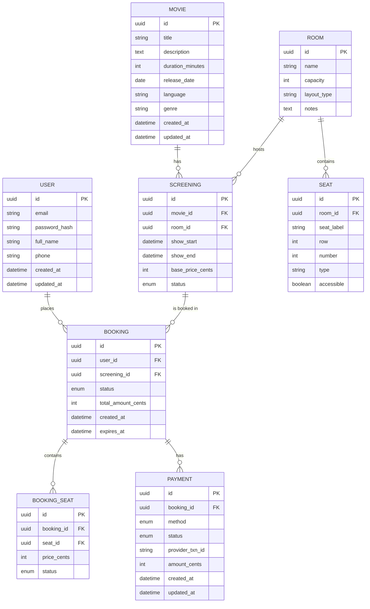
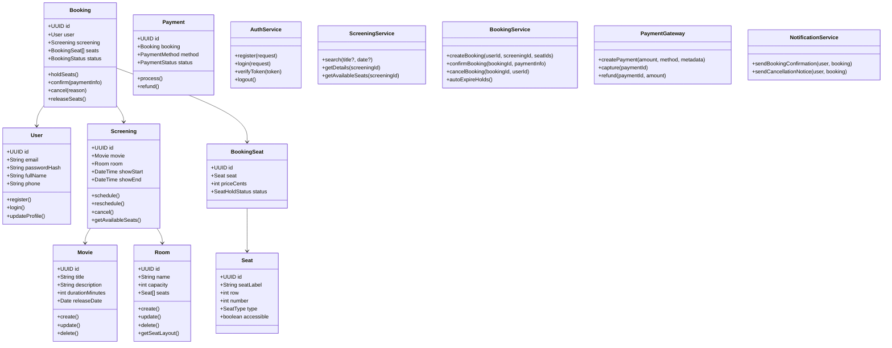
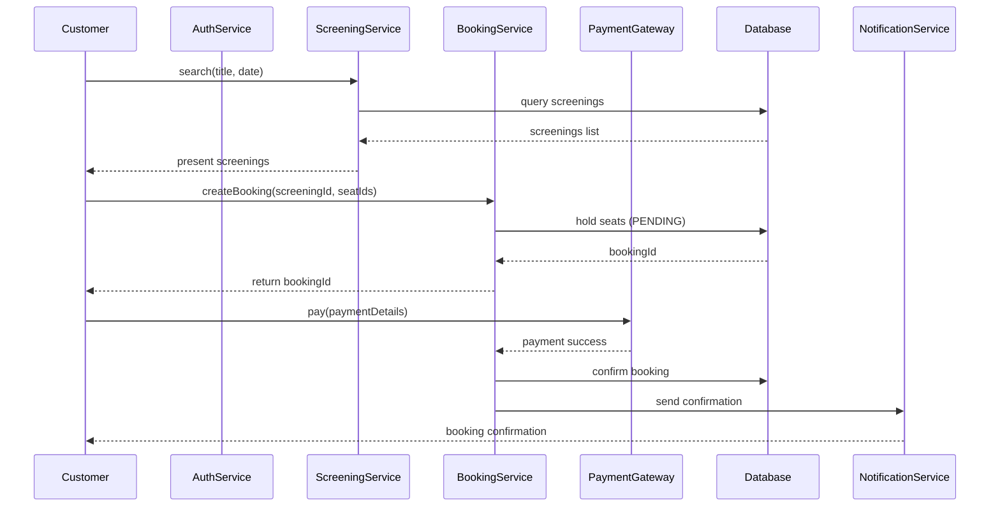
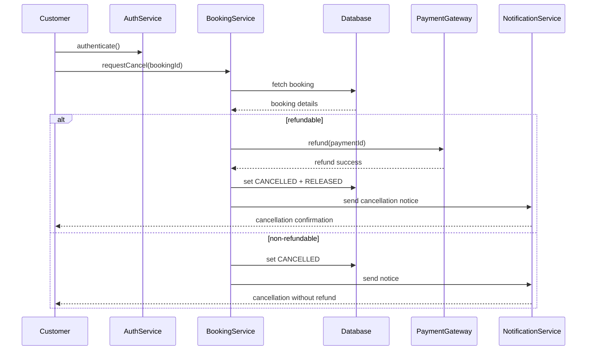
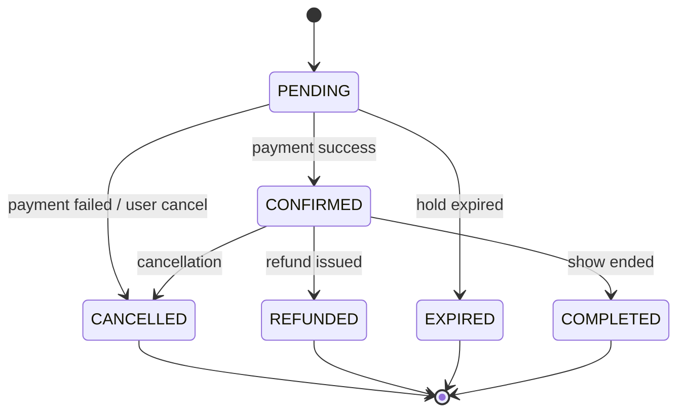
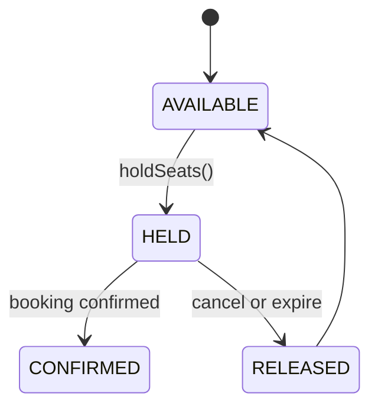
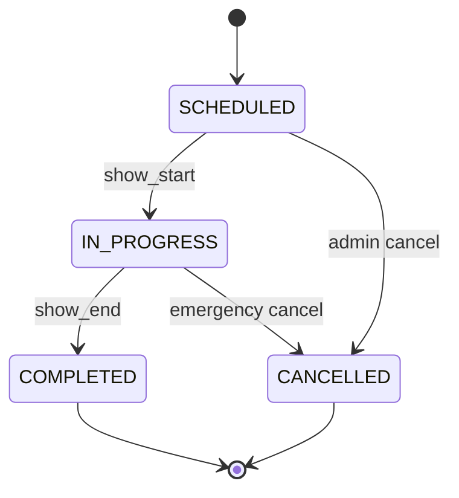

# Cinema Booking System — Design Documentation

This document contains the deliverables for the **Software Developer Design Test**. The design is presented in English, using **Mermaid** diagrams.

---

## 1. Entity-Relationship Diagram (ERD)

---

## 2. Class Design

---

## 3. Sequence Diagram — Reservation

---

## 4. Sequence Diagram — Cancel a Reservation

---

## 5. State Diagrams

### 5.1 Booking

### 5.2 Seat Hold

### 5.3 Screening

---

## 6. Technical Considerations

* **Concurrency Control:** Seats locked via DB transactions and UNIQUE constraints `(screening_id, seat_id)`.
* **Performance:** Cache read-heavy data (screenings, seat maps). Scale horizontally at peak demand.
* **Resilience:** Automatic seat release after TTL expiration for unconfirmed bookings.
* **Security:** JWT-based auth, password hashing, PCI-compliant payments.
* **Monitoring:** Metrics for bookings, expirations, payment failures.

---
